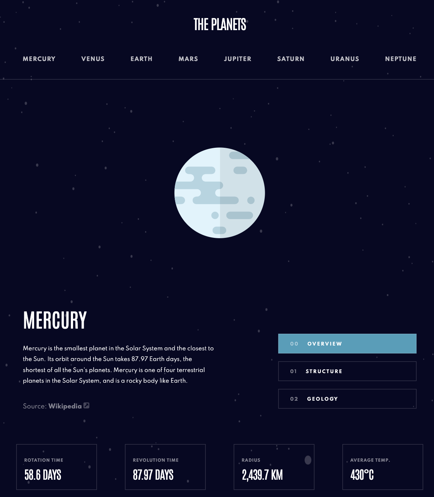
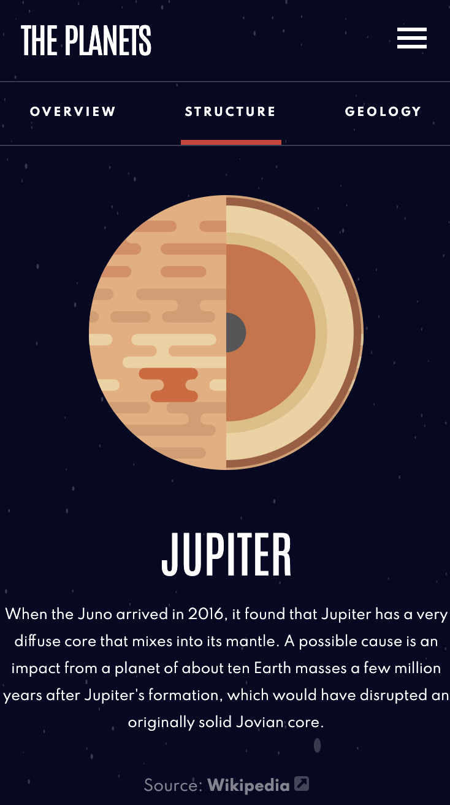

# Frontend Mentor - Planets fact site solution

This is a solution to the [Planets fact site challenge on Frontend Mentor](https://www.frontendmentor.io/challenges/planets-fact-site-gazqN8w_f). Frontend Mentor challenges help you improve your coding skills by building realistic projects.

## Table of contents

- [Overview](#overview)
  - [The challenge](#the-challenge)
  - [Screenshot](#screenshot)
  - [Links](#links)
- [My process](#my-process)
  - [Built with](#built-with)
  - [What I learned](#what-i-learned)
  - [Continued development](#continued-development)
  - [Useful resources](#useful-resources)
- [Author](#author)
- [Acknowledgments](#acknowledgments)

## Overview

A Small Solar System App built using the Svelte compiler/framework.

### The challenge

Users should be able to:

- View the optimal layout for the app depending on their device's screen size
- See hover states for all interactive elements on the page
- View each planet page and toggle between "Overview", "Internal Structure", and "Surface Geology"

### Screenshots

#### The Tablet View of Mercury

#### The Mobile View of Jupiter

### Links

- Live Site URL: [Add live site URL here](https://mrfinesse47.github.io/svelte-planets/)

## My process

I used Svelte and build it top down mobile first. I also kept it simple, and didn't rely on external packages. So no unecessary software bloat.

### Built with

- Semantic HTML5 markup
- Svelte
- Flexbox
- Mobile-first workflow

### What I learned

This was the first project I built using Svelte.

### Continued development

This project is complete. I now look forward to the next project.

### Useful resources

- [Svelte Tutorial](https://www.youtube.com/watch?v=zojEMeQGGHs&list=PL4cUxeGkcC9hlbrVO_2QFVqVPhlZmz7tO&ab_channel=TheNetNinja) - This tutorial from Youtube helped me grasp the basics of Svelte.

- [Svelte Interactive Tutorials](https://svelte.dev/tutorial/basics)
- The official Svelte documentation and tutorial was super helpful as well.

## Author -- Kevin Mason

- Linkedin - [@Kevin Mason](https://www.linkedin.com/in/kevin-mason-7b83b3228/)
- Frontend Mentor - [@mrfinesse47](https://www.frontendmentor.io/profile/mrfinesse47)
- Github - [@mrfinesse47](https://github.com/mrfinesse47/)
- Lichess - [@mrfinesse47](https://lichess.org/@/mrfinesse47)

## Acknowledgments

Thank you to everyone who helps share information online with regards to web development.
